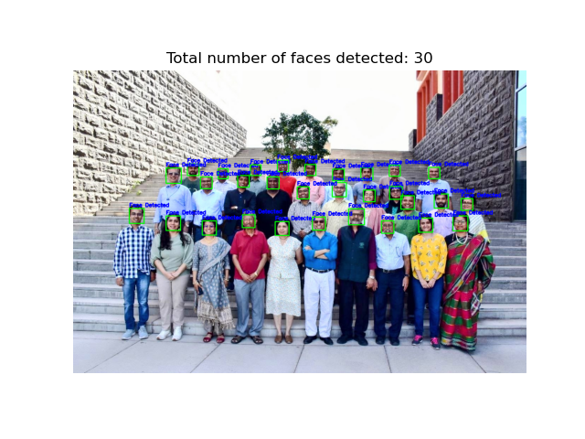
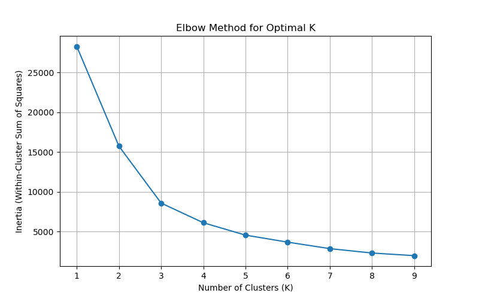
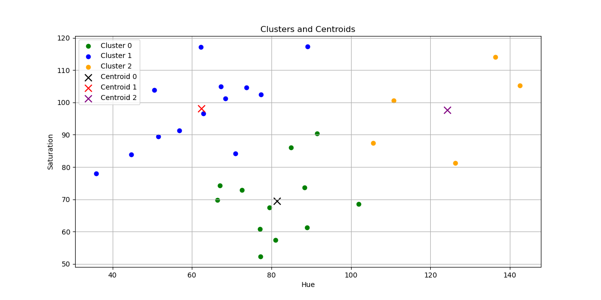
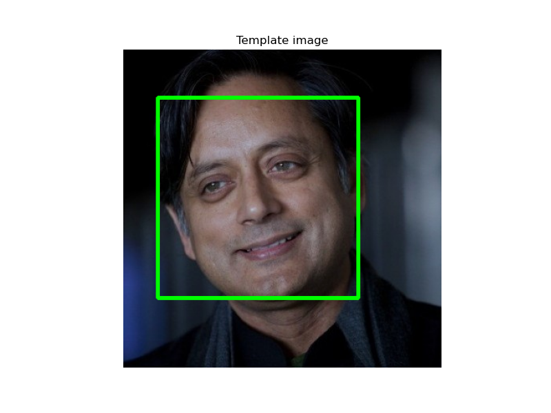
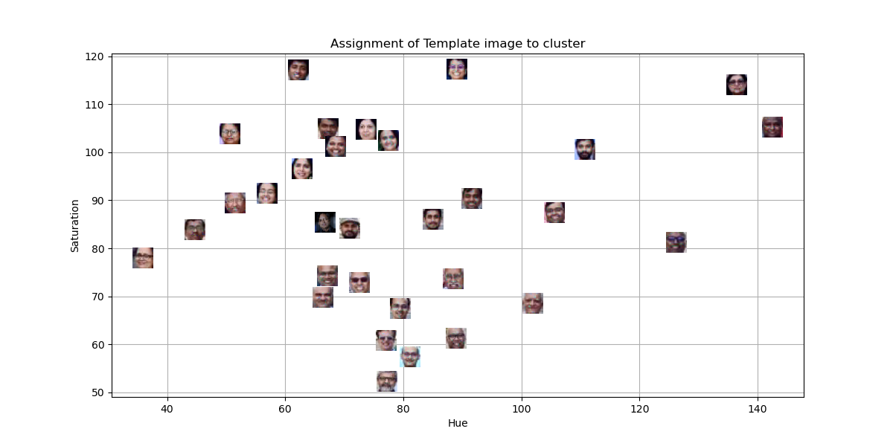
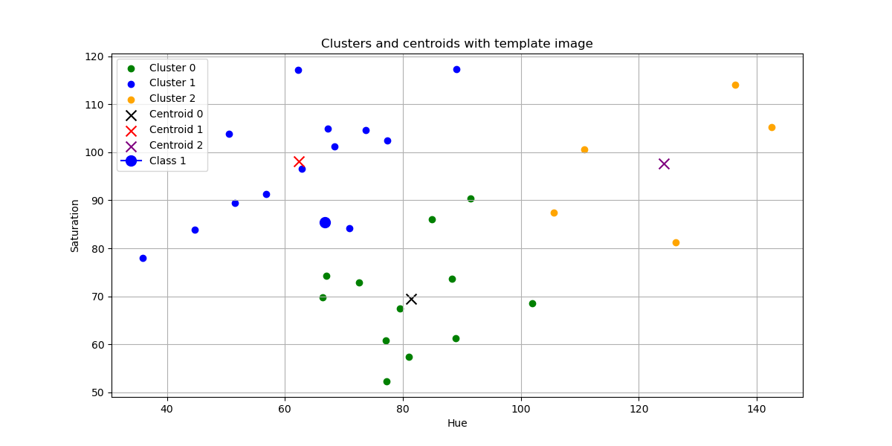
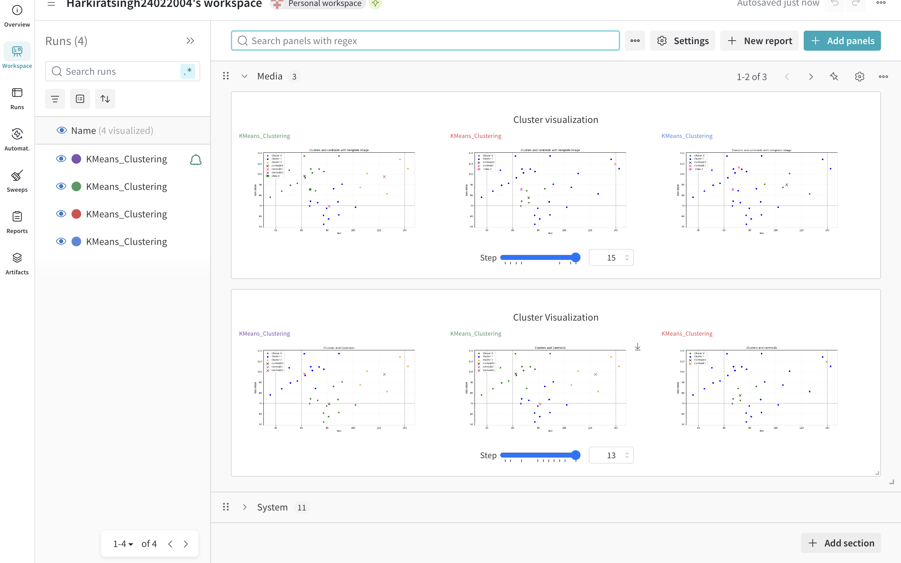

Plaksha Faculty 

Detected Faces

Elbow curve to find the Optimum Value of K

Clusters and Centroids

Template Image

Assigned template image to Cluster

Added template image to Cluster

WANDB Dashboard

